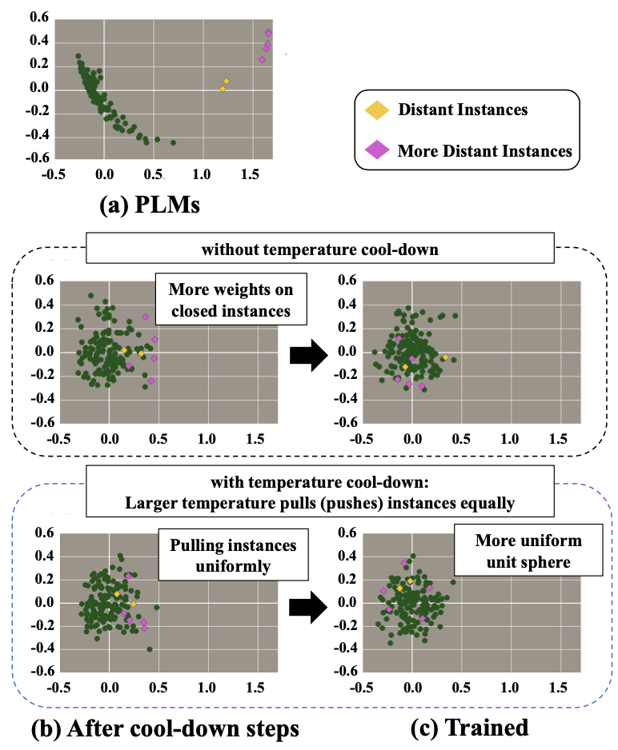

# Simple Temperature Cool-down in Contrastive Framework for Unsupervised Sentence Representation Learning
----
This repo contains implementation of [Simple Temperature Cool-down in Contrastive Framework for Unsupervised Sentence Representation Learning]().

[](https://opensource.org/licenses/MIT)

# Overview

We proposes a simple, tricky method to improve sentence representation of unsupervised contrastive learning. Temperature cool-down technique helps PLMs to be more suitable for contrastive learning via preparation of uniform representation space. PCA visualization of the representation space during contrastive learning with/without temperature cool-down. (a): Following the literature, BERT-base shows the anisotropic representation space. (b): A model trained with temperature cool-down pulls distant instances (colored pink) more uniformly. (c): A representation space built by temperature cool-down leads to a more uniform unit hypersphere.




## Setups

[](https://www.python.org/downloads/release/python-386/)
[](https://pytorch.org/get-started/previous-versions/)

### Requirements

First, install PyTorch by following the instructions from [the official website](https://pytorch.org). 

```bash
pip install torch==1.12.1+cu116 --extra-index-url https://download.pytorch.org/whl/cu116
```

If you instead use **CUDA** `<11` or **CPU**, install PyTorch by the following command,

```bash
pip install torch==1.12.1
```

Then run the following script to install the remaining dependencies,

```bash
pip install -r requirements.txt
```

### Download the pretraining dataset
```
cd data
bash download_wiki.sh
```

### Download the downstream dataset
```
cd Eval/data/
bash download.sh
```

## Training
```bash
python train.py \
    --model_name_or_path bert-base-uncased \
    --train_file data/wiki1m_for_simcse.txt \
    --output_dir result/unsupervised_tc \
    --num_train_epochs 1 \
    --per_device_train_batch_size 64 \
    --learning_rate 3e-5 \
    --max_seq_length 32 \
    --evaluation_strategy steps \
    --metric_for_best_model stsb_spearman \
    --load_best_model_at_end \
    --eval_steps 250 \
    --pooler_type cls \
    --mlp_only_train \
    --overwrite_output_dir \
    --temp 0.10 \
    --temp2 0.05 \
    --do_temp_cooldown \
    --tc_type TCC \ # TCC, TCS, TCL
    --cooldown_rate 0.014 \
    --do_train \
    --do_eval \
    --fp16 \
    "$@"
```

## Evaluation

You can run the commands below for evaluation after using the repo to train a model:

```bash
python evaluation.py \
    --model_name_or_path <output_model_dir> \
    --pooler cls_before_pooler \
    --task_set <sts|transfer|full> \
    --mode test
```

For more detailed information, please check [SimCSE's GitHub repo](https://github.com/princeton-nlp/SimCSE).

## Citation

Please cite our paper if you use Temperature Cooldown in your work:
